# Lucas Multi-Agent System

A **LangGraph-based multi-agent orchestration platform** that dynamically routes conversations between specialized
agents through a clean plugin architecture.

## 🎯 What Lucas Actually Is

Lucas is a working multi-agent system that:

- **Routes conversations intelligently** using LangGraph orchestration
- **Loads plugins dynamically** from directory-based plugin bundles
- **Binds tools to LLMs** for specialized agent capabilities
- **Supports multiple LLM providers** (OpenAI, Claude, Gemini)
- **Provides REST APIs** for chat and plugin management
- **Manages conversation sessions** with message history

## 🏗️ System Architecture

### Current Architecture Diagram

```
┌─────────────────────────────────────────────────────────────────┐
│                         FastAPI Layer                           │
│  ┌─────────────┐ ┌─────────────┐ ┌─────────────┐ ┌─────────────┐│
│  │ Chat API    │ │ Plugin API  │ │ Status API  │ │ Session API ││
│  │ /chat       │ │ /plugins    │ │ /status     │ │ /sessions   ││
│  └─────────────┘ └─────────────┘ └─────────────┘ └─────────────┘│
└─────────────────────────────────────────────────────────────────┘
                                │
                                ▼
┌─────────────────────────────────────────────────────────────────┐
│                  LangGraph Orchestrator                         │
│  ┌─────────────┐ ┌─────────────┐ ┌─────────────┐ ┌─────────────┐│
│  │ Coordinator │ │ Control     │ │  Plugin     │ │  Finalizer  ││
│  │    Node     │ │ Tools Node  │ │  Agents     │ │    Node     ││
│  └─────────────┘ └─────────────┘ └─────────────┘ └─────────────┘│
└─────────────────────────────────────────────────────────────────┘
                                │
                                ▼
┌─────────────────────────────────────────────────────────────────┐
│                     Plugin Manager                              │
│  ┌─────────────┐ ┌─────────────┐ ┌─────────────┐ ┌─────────────┐│
│  │   Plugin    │ │   Bundle    │ │   Health    │ │   Dynamic   ││
│  │ Discovery   │ │ Creation    │ │  Checking   │ │  Loading    ││
│  └─────────────┘ └─────────────┘ └─────────────┘ └─────────────┘│
└─────────────────────────────────────────────────────────────────┘
                                │
                                ▼
┌─────────────────────────────────────────────────────────────────┐
│                    LLM Model Factory                            │
│  ┌─────────────┐ ┌─────────────┐ ┌─────────────┐ ┌─────────────┐│
│  │   OpenAI    │ │  Anthropic  │ │   Google    │ │   Model     ││
│  │  Provider   │ │  Provider   │ │  Provider   │ │   Cache     ││
│  └─────────────┘ └─────────────┘ └─────────────┘ └─────────────┘│
└─────────────────────────────────────────────────────────────────┘
```

### LangGraph Workflow

```
User Message → Coordinator → Control Tools → Plugin Agent → Plugin Tools → Coordinator (loop) → Finalizer → Response
```

**Detailed Flow:**

1. **Coordinator**: Analyzes user input and routes to appropriate plugin via `goto_{plugin}` tools
2. **Control Tools**: Executes routing decision
3. **Plugin Agent**: Specialized agent processes request using bound LLM + tools
4. **Plugin Tools**: Agent tools execute (math, search, etc.)
5. **Back to Coordinator**: Continue or finalize decision
6. **Finalizer**: Synthesizes final response for user

### LangGraph Node & Edge Structure

Here's the simplified view of how LangGraph nodes, edges, and routing work in Lucas:

```mermaid
graph TD
    %% Entry Point
    START([🚀 START]) --> coordinator[🎯 coordinator<br/>Node]

    %% Coordinator Decision
    coordinator --> coord_decision{Has tool_calls?}
    coord_decision -->|Yes| control_tools[⚙️ control_tools<br/>ToolNode]
    coord_decision -->|No| END1([🏁 END])

    %% Control Tools Routing
    control_tools --> route_decision{🎯 Route Decision}
    route_decision -->|goto_math| math_agent[🔢 math_agent<br/>Node]
    route_decision -->|goto_search| search_agent[🔍 search_agent<br/>Node]
    route_decision -->|goto_kb| kb_agent[📚 kb_agent<br/>Node]
    route_decision -->|finalize| END2([🏁 END])

    %% Math Agent Path
    math_agent --> math_decision{Has tool_calls?}
    math_decision -->|Yes| math_tools[🔢 math_tools<br/>ToolNode<br/>add, subtract, multiply]
    math_decision -->|No| coordinator
    math_tools --> math_agent

    %% Search Agent Path
    search_agent --> search_decision{Has tool_calls?}
    search_decision -->|Yes| search_tools[🔍 search_tools<br/>ToolNode<br/>web_search]
    search_decision -->|No| coordinator
    search_tools --> search_agent

    %% KB Agent Path
    kb_agent --> kb_decision{Has tool_calls?}
    kb_decision -->|Yes| kb_tools[📚 kb_tools<br/>ToolNode<br/>kb_get, kb_list]
    kb_decision -->|No| coordinator
    kb_tools --> kb_agent

    %% Styling
    classDef startEnd fill:#e1f5fe,stroke:#01579b,stroke-width:3px
    classDef coordinatorNode fill:#e8f5e8,stroke:#2e7d32,stroke-width:2px
    classDef agentNode fill:#fff3e0,stroke:#e65100,stroke-width:2px
    classDef toolNode fill:#f3e5f5,stroke:#4a148c,stroke-width:2px
    classDef decision fill:#fff9c4,stroke:#f57f17,stroke-width:2px

    class START,END1,END2 startEnd
    class coordinator coordinatorNode
    class math_agent,search_agent,kb_agent agentNode
    class control_tools,math_tools,search_tools,kb_tools toolNode
    class coord_decision,route_decision,math_decision,search_decision,kb_decision decision
```



**LangGraph Core Concepts:**

- **🎯 Nodes**: Callable functions that process the AgentState (`coordinator`, `math_agent`, `search_agent`, `kb_agent`)
- **⚙️ ToolNodes**: Special nodes that execute tool calls:
    - `control_tools`: Routing tools (`goto_math`, `goto_search`, `goto_kb`, `finalize`)
    - `math_tools`: Math operations (`add`, `subtract`, `multiply`)
    - `search_tools`: Web search (`web_search`)
    - `kb_tools`: Knowledge base (`kb_get`, `kb_list`)
- **🔀 Conditional Edges**: Decision points that route based on state:
    - Tool call presence: `has tool_calls?`
    - Route decision: `goto_math` → `math_agent`
- **➡️ Direct Edges**: Fixed connections between nodes (`math_tools` → `math_agent`)
- **🔄 Agent Loops**: Each agent can call its tools multiple times before returning to coordinator
- **🛡️ Safety**: MAX_HOPS=10 prevents infinite loops

### LangGraph Routing Flow Example

Here's the detailed step-by-step flow of how Lucas processes a user message through the LangGraph workflow:


**Key Points in the Flow:**

1. **Session Management**: Tracks conversation history across multiple interactions
2. **Hop Counter**: Prevents infinite loops with MAX_HOPS=10 limit
3. **Dynamic Routing**: Coordinator uses LLM to intelligently choose the right agent
4. **Tool Binding**: Each agent has specialized tools bound to its LLM model
5. **State Management**: AgentState carries context through the entire workflow
6. **Finalization**: Synthesizes all agent work into a coherent final response

## 📁 Project Structure

```
lucas/
├── src/lucas/
│   ├── core/
│   │   ├── orchestrator.py      # LangGraph multi-agent coordinator
│   │   └── state.py             # AgentState management
│   ├── plugins/
│   │   ├── manager.py           # Plugin discovery & bundle creation
│   │   ├── loader.py            # Dynamic module loading
│   │   └── base.py              # Plugin interfaces
│   ├── llm/
│   │   ├── factory.py           # Multi-provider LLM factory
│   │   └── providers.py         # OpenAI, Claude, Gemini providers
│   ├── api/
│   │   └── routes.py            # FastAPI endpoints
│   ├── config/
│   │   └── settings.py          # Environment-based configuration
│   └── main.py                  # FastAPI application entry point
├── plugins/
│   └── examples/
│       ├── math_agent/          # Mathematical operations
│       │   ├── plugin.py        # Plugin entry point
│       │   ├── agent.py         # Math agent implementation
│       │   └── tools.py         # Math tools (add, subtract, etc.)
│       └── search_agent/        # Web search capabilities
│           ├── plugin.py
│           ├── agent.py
│           └── tools.py
└── tests/
```

## 🔧 Core Components

### MultiAgentOrchestrator

The heart of Lucas - orchestrates conversation flow using LangGraph:

```python
class MultiAgentOrchestrator:
    """Coordinates sequential, tool-routed multi-agent workflow."""

    # Graph: coordinator -> control_tools -> {plugin}_agent -> {plugin}_tools -> coordinator -> finalizer
    # State: AgentState with messages history and hops counter (prevents loops)
    # Routing: Dynamic tool generation for each loaded plugin
```

### PluginManager

Discovers and manages plugin bundles:

```python
class PluginManager:
    """Discovers, validates, loads, and health-checks plugin bundles."""

    # Discovers plugins by scanning for plugin.py files
    # Creates PluginBundle with metadata, agent, bound model, tools
    # Provides coordinator tools for routing (goto_{plugin}, finalize)
```

### LLMModelFactory

Multi-provider LLM management with caching:

```python
class LLMModelFactory:
    """Creates and caches chat models with provider abstraction."""

    # Supports: OpenAI, Anthropic/Claude, Google/Gemini
    # Caches models by provider:model:temperature
    # Binds tools to models for plugin agents
```

### Plugin Architecture

Each plugin bundle contains:

```python
class BasePluginAgent:
    """Base class for plugin agents used as LangGraph nodes."""

    # get_tools() -> List[Tool]        # Tools for this agent
    # get_system_prompt() -> str       # Agent's system prompt
    # bind_model(model) -> model       # Bind tools to LLM
    # create_agent_node() -> callable  # LangGraph node function
```

## 🚀 Getting Started

### 1. Installation

```bash
# Clone repository
git clone <repo-url>
cd lucas

# Install dependencies
pip install -r requirements.txt

# Set up environment
cp .env.example .env
# Edit .env with your API keys
```

### 2. Configuration

```bash
# Required environment variables
LUCAS_OPENAI_API_KEY=your_openai_key
LUCAS_ANTHROPIC_API_KEY=your_anthropic_key
LUCAS_GOOGLE_API_KEY=your_google_key

# Optional settings
LUCAS_DEFAULT_LLM_PROVIDER=openai
LUCAS_PLUGINS_DIR=./plugins
LUCAS_API_PORT=8000
```

### 3. Run the System

```bash
# Start the FastAPI server
python -m src.lucas.main

# Or using uvicorn directly
uvicorn src.lucas.main:app --host 0.0.0.0 --port 8000 --reload
```

### 4. Test with API

```bash
# Chat with the system
curl -X POST http://localhost:8000/api/v1/chat \
  -H "Content-Type: application/json" \
  -d '{"message": "What is 15 + 27?"}'

# List available plugins
curl http://localhost:8000/api/v1/plugins

# Check system status
curl http://localhost:8000/api/v1/status
```

## 🔌 Current Plugins

### Math Agent

- **Capabilities**: addition, subtraction, multiplication, division, power, modulo
- **Tools**: 6 mathematical operation tools
- **Use Cases**: Mathematical calculations, arithmetic problems

### Search Agent

- **Capabilities**: web_search, news_search, academic_search, image_search, information_lookup
- **Tools**: Web search and information retrieval tools
- **Use Cases**: Finding information, research assistance

## 🛠️ Creating a Plugin

### 1. Plugin Structure

```
my_plugin/
├── plugin.py      # Entry point with metadata
├── agent.py       # Agent implementation
├── tools.py       # Tool definitions
└── requirements.txt
```

### 2. Plugin Entry Point

```python
# plugin.py
from lucas.plugins.base import BasePlugin, PluginMetadata


class MyPlugin(BasePlugin):
    @staticmethod
    def get_metadata() -> PluginMetadata:
        return PluginMetadata(
            name="my_plugin",
            version="1.0.0",
            description="My custom plugin",
            capabilities=["feature1", "feature2"],
            llm_requirements={
                "provider": "openai",
                "model": "gpt-4o",
                "temperature": 0.1
            }
        )

    @staticmethod
    def create_agent() -> BasePluginAgent:
        return MyAgent(MyPlugin.get_metadata())


# Required exports
get_metadata = MyPlugin.get_metadata
create_agent = MyPlugin.create_agent
```

### 3. Agent Implementation

```python
# agent.py
from lucas.plugins.base import BasePluginAgent


class MyAgent(BasePluginAgent):
    def get_tools(self) -> List[Tool]:
        # Return your tools here
        return [tool1, tool2]

    def get_system_prompt(self) -> str:
        return "You are MyAgent specialized in..."
```

### 4. Tool Definitions

```python
# tools.py
from langchain_core.tools import tool


@tool
def my_tool(input: str) -> str:
    """Tool description for LLM."""
    return f"Processed: {input}"


# Export tools
my_tools = [my_tool]
```

## 📊 API Reference

### Chat Endpoint

```http
POST /api/v1/chat
Content-Type: application/json

{
  "message": "Your question here",
  "session_id": "optional-session-id",
  "metadata": {}
}
```

Response:

```json
{
  "response": "Agent response",
  "session_id": "session-id",
  "plugin_used": "plugin_name",
  "agents_used": [
    "agent1",
    "agent2"
  ],
  "hops": 3,
  "metadata": {
    "message_count": 5,
    "routing_history": [
      "math_agent",
      "search_agent"
    ]
  }
}
```

### Plugin Management

```http
GET /api/v1/plugins              # List all plugins
GET /api/v1/plugins/{name}       # Get specific plugin info
POST /api/v1/plugins/reload      # Reload all plugins
GET /api/v1/status               # System status
```

### Session Management

```http
DELETE /api/v1/sessions/{id}     # Clear session history
GET /api/v1/health               # Health check
```

## 🎯 What's Working Now

✅ **Multi-Agent Orchestration**: LangGraph-based routing between specialized agents  
✅ **Dynamic Plugin Loading**: Directory-based plugin discovery and loading  
✅ **Multi-Provider LLMs**: OpenAI, Claude, Gemini support with caching  
✅ **Tool Binding**: Automatic tool binding to agent-specific models  
✅ **REST API**: Complete FastAPI service with session management  
✅ **Working Examples**: Math and Search agents with real functionality  
✅ **Configuration**: Environment-based settings with validation  
✅ **Health Checks**: Plugin health monitoring and reload capabilities

## 🚧 Future Roadmap

### Phase 1: Enhanced Plugin Ecosystem (Next 2-4 weeks)

- [ ] **Plugin Validation**: Schema validation for plugin structure and dependencies
- [ ] **Plugin Templates**: Generator for new plugin boilerplate
- [ ] **Error Handling**: Better error recovery and fallback mechanisms
- [ ] **Plugin Config**: Runtime configuration for plugins via API

### Phase 2: Production Features (1-2 months)

- [ ] **Persistent Sessions**: Redis/PostgreSQL session storage
- [ ] **Authentication**: JWT-based user authentication and authorization
- [ ] **Rate Limiting**: API rate limiting and usage quotas
- [ ] **Metrics**: Basic Prometheus metrics and health endpoints
- [ ] **Logging**: Structured logging with request tracing

### Phase 3: Advanced Capabilities (2-3 months)

- [ ] **Git Plugin Loading**: Dynamic plugin installation from Git repositories
- [ ] **Plugin Marketplace**: Registry for discovering and sharing plugins
- [ ] **Multi-Turn Context**: Advanced context management across conversations
- [ ] **Parallel Agents**: Support for parallel agent execution
- [ ] **Streaming Responses**: WebSocket streaming for real-time responses

### Phase 4: Enterprise Features (3-6 months)

- [ ] **Security Sandbox**: Isolated plugin execution environment
- [ ] **Monitoring Stack**: Full observability with distributed tracing
- [ ] **Admin Dashboard**: Web UI for plugin and system management
- [ ] **A/B Testing**: Framework for testing different agent configurations
- [ ] **Horizontal Scaling**: Multi-instance deployment with load balancing

### Phase 5: Business Agents (6+ months)

- [ ] **E-commerce Agent**: Product search, inventory, orders, payments
- [ ] **Support Agent**: Ticket management, FAQ, escalation workflows
- [ ] **Analytics Agent**: Data queries, report generation, visualizations
- [ ] **Document Agent**: PDF processing, summarization, Q&A
- [ ] **Code Agent**: Code analysis, generation, debugging assistance

## 🤝 Contributing

1. **Plugin Development**: Create new domain-specific agents
2. **Core Features**: Enhance orchestration, plugin management, or API layers
3. **Documentation**: Improve guides, examples, and API documentation
4. **Testing**: Add test coverage for plugins and core functionality

## 📝 Technical Notes

- **LangGraph**: Used for stateful multi-agent orchestration with loop prevention
- **Plugin Loading**: Dynamic module loading with importlib and path management
- **Model Caching**: Prevents redundant LLM instantiation for performance
- **State Management**: AgentState tracks messages, routing, and plugin context
- **Tool Binding**: Each plugin gets a specialized LLM model with its tools bound

## 🐛 Known Limitations

- **In-Memory Sessions**: Sessions are lost on restart (Phase 2 addresses this)
- **No Authentication**: Open API endpoints (Phase 2 adds auth)
- **Basic Error Handling**: Limited error recovery (Phase 1 improves this)
- **Single Instance**: No horizontal scaling support yet (Phase 4)
- **Plugin Security**: No sandbox isolation (Phase 4)

---

**Lucas is a working, practical multi-agent system that demonstrates clean LangGraph orchestration with a plugin
architecture. The roadmap provides a clear path toward enterprise-grade capabilities.**
